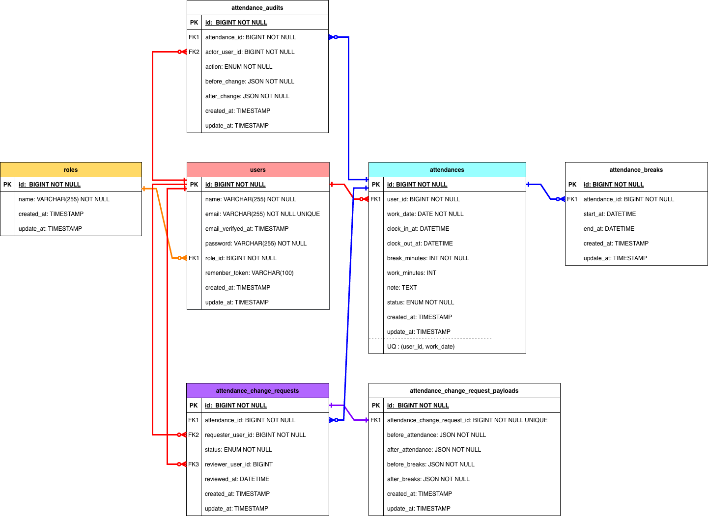

# coachtech 勤怠管理アプリ

ユーザーの打刻（出勤/退勤/休憩）と勤怠確認、修正申請〜管理者承認までを扱う勤怠管理アプリケーションです。

## 環境構築

### 必要なソフトウェア

- **Git**: リポジトリのクローン用
- **Docker**: コンテナ実行環境
- **Docker Compose**: マルチコンテナ管理

**注意**: PHP / Laravel / MySQL は Docker コンテナ内で動作します。Node.js は本リポジトリのコンテナには含まれていないため、フロントのビルドが必要な場合はホスト側に Node.js を用意してください。
補足：本アプリは `public/js` の素のJavaScriptも利用していますが、**テスト実行や通常利用に Node.js は必須ではありません。**

### Docker ビルド

1. リポジトリをクローン

```bash
git clone https://github.com/pon02/coachtech-time-and-attendance.git
cd coachtech-time-and-attendance
```

2. Docker コンテナをビルド・起動

```bash
docker compose up -d --build
```

3. コンテナの起動確認

```bash
docker compose ps
```

### Laravel 環境構築

1. PHP コンテナに入る

```bash
docker compose exec php bash
```

2. 依存関係をインストール

```bash
composer install
```

3. 環境変数ファイルをコピー

```bash
cp .env.example .env
```

4. アプリケーションキーを生成

```bash
php artisan key:generate
```

5. データベースをマイグレーション・シード

```bash
php artisan migrate --seed
```

6. ストレージリンクを作成

```bash
php artisan storage:link
```

7. フロントエンドアセットをビルド

（任意）フロントエンドの依存を入れる場合（ホスト側で `src/` に移動して実行）

```bash
npm install
```

```bash
npm run dev
```

※ 画面表示用のCSS/JSがすでに配置されているため、**動作確認やテストだけならこの手順はスキップ可能**です。

## 使用技術（実行環境）

### バックエンド

- **PHP**: 8.1
- **Laravel**: 9.x
- **MySQL**: 8.0

### フロントエンド

- **HTML/CSS/JavaScript**
- **Laravel Mix**

### 認証

- **Laravel Fortify**: メール認証機能


### 開発環境

- **Docker**: コンテナ化
- **Docker Compose**: マルチコンテナ管理
- **Nginx**: Web サーバー
- **phpMyAdmin**: データベース管理
- **MailHog**: メール送信テスト

### テスト

- **PHPUnit**: 統合テスト

## ER 図



## URL

### 開発環境

- **アプリケーション**: http://localhost
- **phpMyAdmin**: http://localhost:8080
- **MailHog**: http://localhost:8025

### 主要な機能 URL

- **トップページ**: http://localhost/
- **会員登録**: http://localhost/register
- **ログイン**: http://localhost/login
- **打刻**: http://localhost/attendance
- **勤怠一覧**: http://localhost/attendance/list
- **勤怠詳細**: http://localhost/attendance/detail/{id}
- **申請一覧**: http://localhost/stamp_correction_request/list
- **管理者ログイン**: http://localhost/admin/login
- **管理者 勤怠一覧**: http://localhost/admin/attendance/list
- **管理者 勤怠詳細**: http://localhost/admin/attendance/{id}
- **管理者 スタッフ一覧**: http://localhost/admin/staff/list
- **管理者 スタッフ別勤怠一覧**: http://localhost/admin/attendance/staff/{id}
- **管理者 修正申請承認** http://localhost/stamp_correction_request/approve/{attendance_correct_request_id}

## 機能一覧

### 認証機能

- 会員登録
- メール認証
- ログイン・ログアウト
- （管理者）管理者ログイン

### 勤怠打刻機能

- 出勤（打刻）
- 休憩開始 / 休憩終了
- 退勤（打刻）
- ステータス表示（勤務外/出勤中/休憩中/退勤済）

### 勤怠一覧・詳細表示機能

- 勤怠一覧（月次）表示
- 「前月」「翌月」での月移動
- 勤怠詳細表示
- （管理者）スタッフ別月次勤怠表示
- （管理者）月次勤怠CSV出力

### 修正申請・承認機能

- 修正申請（ユーザー）
- 修正申請一覧（承認待ち/承認済み）
- （管理者）申請内容の確認と承認

## 動作確認用ユーザー

アプリケーションの動作確認のため、Seeder で作成している以下のデモアカウントをご利用ください：

| 種別 | 氏名 | メールアドレス | パスワード |
| --- | --- | --- | --- |
| 管理者 | 管理者 太郎 | admin@example.com | 09876543 |
| 一般 | 一般 花子 | user@example.com | 12345678 |

**※注意**: これらはデモ用アカウントです。本番環境では使用しないでください。

## テスト

### テスト実行前の準備（初回のみ）

このリポジトリは MySQL を使用します。テストは `laravel_test` データベースを使うため、初回は DB を作成し、`.env.testing` を準備してください。

1) `.env.testing` を作成

```bash
# src/.env.testing を作成（テスト環境）
docker compose exec -T php cp .env.example .env.testing
```

2) APP_KEY を生成（テスト）

```bash
docker compose exec -T php php artisan key:generate --env=testing
```

3) テスト用DBを作成（`laravel_test`）

```bash
docker compose exec -T mysql mysql -uroot -pdev_root_pass -e "CREATE DATABASE IF NOT EXISTS laravel_test; GRANT ALL PRIVILEGES ON laravel_test.* TO 'laravel_user'@'%'; FLUSH PRIVILEGES;"
```

4) 接続確認（任意）

```bash
docker compose exec -T php php artisan migrate:fresh --seed --env=testing
```

※ もし `storage` / `bootstrap/cache` の権限エラーが出る場合のみ、以下を実行してください。

```bash
docker compose exec -T php chmod -R 777 storage bootstrap/cache
```

```bash
# 全テスト実行（testing環境）
docker compose exec -T php php artisan test --env=testing

# Featureテストのみ実行
docker compose exec -T php php artisan test --env=testing --testsuite=Feature

# 特定のテストファイルを実行
docker compose exec -T php php artisan test --env=testing tests/Feature/Auth/LoginTest.php
```
